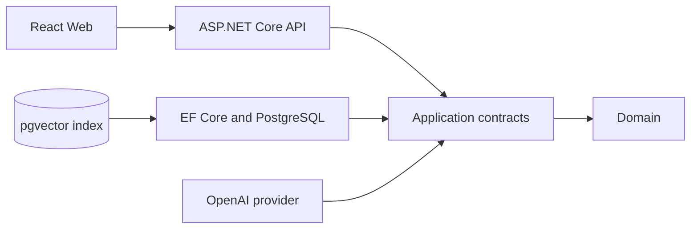

# Knowledge Desk

Knowledge Desk turns practical engineering experience into searchable internal knowledge and grounded AI answers.

## Repository layout

```text
Knowledge Desk/
├── backend/                         # .NET 10 API and local infrastructure
│   ├── src/
│   │   ├── InternalKnowledge.Api/          # HTTP composition root
│   │   ├── InternalKnowledge.Application/  # Use-case contracts
│   │   ├── InternalKnowledge.Domain/       # Knowledge aggregate
│   │   ├── InternalKnowledge.Persistence/  # EF Core, pgvector, migrations
│   │   ├── InternalKnowledge.AI/           # OpenAI and local AI adapters
│   │   ├── InternalKnowledge.Indexing/     # Future indexing hosts
│   │   └── InternalKnowledge.Infrastructure/
│   ├── tests/
│   ├── docker-compose.yml
│   └── KnowledgeDesk.slnx
└── frontend/
    └── InternalKnowledge.Web/       # React, TypeScript, Vite, Material UI
```

## Architecture



The domain has no infrastructure dependencies. The API is the composition root. Embeddings live in a separate versioned search-index table so models can be migrated without changing knowledge records.

## Prerequisites

- .NET SDK 10
- Node.js 22+
- pnpm
- Docker Desktop with WSL 2 enabled

## Run locally

```powershell
cd backend
docker compose up -d --wait
dotnet run --project src/InternalKnowledge.Api --urls http://127.0.0.1:5088
```

In another terminal:

```powershell
cd frontend/InternalKnowledge.Web
pnpm install
pnpm dev
```

Open `http://localhost:3000`. The API applies EF Core migrations at startup and exposes `/health` plus OpenAPI in Development.

### PostgreSQL GUI

Docker Compose also starts pgAdmin at `http://localhost:5050`.

- pgAdmin email: `admin@knowledgedesk.dev`
- pgAdmin password: `knowledge_admin`
- Registered server: `Knowledge Desk PostgreSQL`
- Database password when prompted: `knowledge_local`

The PostgreSQL host inside pgAdmin is `postgres`, because pgAdmin runs in the same Docker network.

## OpenAI configuration

The default `Ai:Provider` is `Local`, which provides deterministic development extraction and embeddings without external calls. When the API key is available, configure it outside source control:

```powershell
cd backend/src/InternalKnowledge.Api
dotnet user-secrets init
dotnet user-secrets set "Ai:Provider" "OpenAI"
dotnet user-secrets set "Ai:ApiKey" "YOUR_KEY"
```

Models and thresholds are strongly typed under `AiOptions`. Override model names with `Ai__ChatModel`, `Ai__ExtractionModel`, and `Ai__EmbeddingModel`. Never add a real key to `appsettings.json` or an `.env` file committed to Git.

The OpenAI adapter uses the Responses API for structured extraction and grounded answers, and the Embeddings API for semantic search. Prompts are centralized and versioned. Missing root causes or solutions remain unknown rather than being fabricated.

## Embedding migrations

Do not mix vectors from different embedding models in one active index. Change the configured model/version, mark existing rows `ReindexRequired`, regenerate vectors, then promote the new version. The current schema records model, version, status, timestamps, and indexing errors.

## Validation

```powershell
cd backend
dotnet build KnowledgeDesk.slnx --configfile NuGet.Config
dotnet test KnowledgeDesk.slnx --no-build --no-restore

cd ../frontend/InternalKnowledge.Web
pnpm build
```
